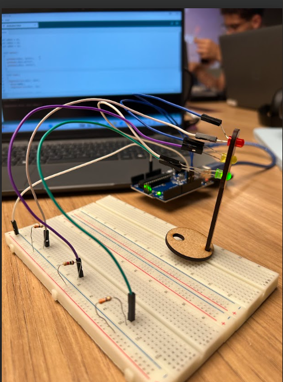
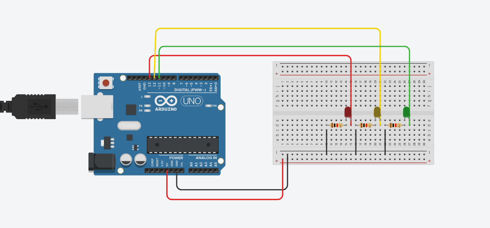

# Tutorial: Montagem de um Circuito de Semáforo com Arduino UNO

## Objetivo
Criar um circuito simples de **semáforo** utilizando três LEDs (vermelho, amarelo e verde) controlados por um Arduino UNO, com resistores limitadores de corrente para proteger os componentes.


## Materiais Utilizados

| **Componente**     | **Quantidade** | **Função** | **Especificações** |
|--------------------|----------------|-------------|--------------------|
| Arduino UNO R3     | 1              | Controlador principal | Tensão de operação: 5V |
| LED vermelho        | 1              | Indicar “Pare” | Tensão típica: 2.0V / Corrente: 20mA |
| LED amarelo         | 1              | Indicar “Atenção” | Tensão típica: 2.0V / Corrente: 20mA |
| LED verde           | 1              | Indicar “Siga” | Tensão típica: 2.2V / Corrente: 20mA |
| Resistores          | 3              | Limitar corrente dos LEDs | 220 Ω (pode variar até 330 Ω) |
| Protoboard          | 1              | Facilitar conexões | — |
| Jumpers (macho-macho) | 7          | Fazer ligações entre Arduino e protoboard | — |
| Cabo USB            | 1              | Alimentação e comunicação com o Arduino | — |


## Montagem do Circuito

### 1. Conexão dos LEDs
- Posicione os três LEDs na protoboard, deixando espaço entre eles.  
- O terminal mais longo (ânodo) deve ser conectado ao Arduino (via resistor).  
- O terminal mais curto (cátodo) deve ser conectado ao GND (linha negativa da protoboard).

### 2. Ligação dos resistores
- Cada resistor de 220 Ω é conectado em série com o ânodo de cada LED, limitando a corrente que passa por ele.

### 3. Conexão com o Arduino
| **LED** | **Pino Digital do Arduino** | **Cor do Fio** |
|----------|-----------------------------|----------------|
| Vermelho | 13| Vermelho |
| Amarelo  | 12 | Amarelo | 
| Verde    | 11 | Verde | 


- Ligue os pinos digitais 13, 12 e 11 do Arduino aos resistores (cada um correspondente a um LED).  
- Conecte o GND do Arduino à linha negativa da protoboard.  


## Imagem da Montagem
Aqui uma imagem da versão física: 



link de acesso a imagem no drive: https://drive.google.com/file/d/12M8riEpxMSxOjAuGpDBekK-E9xdVSKOL/view?usp=sharing 

A imagem abaixo mostra de forma mais clara a ligação do circuito no Thinkercard:



*(Figura 1 – Ligação dos LEDs e resistores ao Arduino UNO)*
link de acesso a imagem no drive: https://drive.google.com/file/d/136HovEDri3Hz8a7AR3yFxQ8mmcljxuxu/view?usp=sharing

Link para vídeo: https://drive.google.com/file/d/1fm2W4zjyNJll-RstV2ZM0f6bxEC5iZu-/view?usp=sharing

## Justificativas Técnicas

- Resistores de 220 Ω foram usados para limitar a corrente dos LEDs e evitar que queimem.  
  - A corrente ideal para LEDs comuns é de cerca de 20 mA.  
  - Usando a Lei de Ohm (R = V/I), com uma queda de tensão de 3V (5V do Arduino - 2V do LED):  
    ```
    R = 3V / 0.02A = 150Ω
    ```
  - Portanto, valores entre 220Ω e 330Ω são seguros e reduzem o brilho excessivo.
- Cada LED é controlado por um pino digital independente, permitindo acionar individualmente as cores do semáforo.
- O GND comum é necessário para o retorno da corrente e funcionamento correto do circuito.


## Código de Exemplo (Arduino IDE)

```cpp
class Led {
  private:
    int pino; // o atributo será o número do pino

  public:
    // inicializa o pino
    Led(int p) {
      pino = p;
      pinMode(pino, OUTPUT);
    }

    void ligar() {
      digitalWrite(pino, HIGH);
    }

    void desligar() {
      digitalWrite(pino, LOW);
    }

    // Pisca o LED por um tempo determinado
    void piscar(int tempo) {
      ligar();
      delay(tempo);
      desligar();
    }
};

// Ponteiros para objetos Led
Led* led13;
Led* led12;
Led* led11;

void setup() {
  // Alocação dinâmica dos LEDs
  led13 = new Led(13);
  led12 = new Led(12);
  led11 = new Led(11);
}

void loop() {
  led13->piscar(6000); 
  led12->piscar(2000);
  led11->piscar(4000);
}

